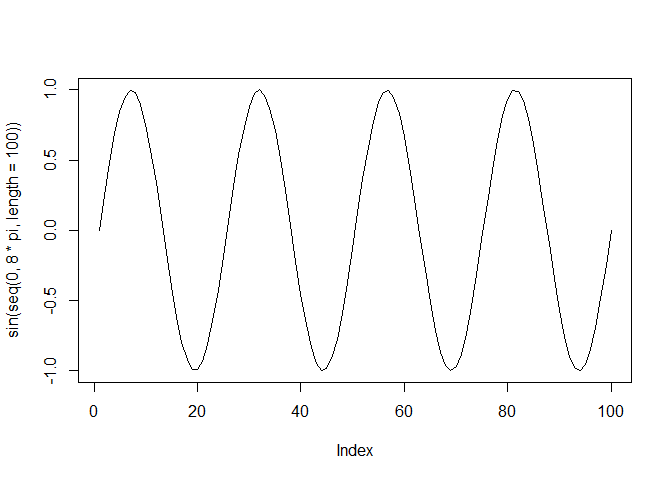

HW 2
================

MAKE A BIG TITLE!
=================

### Introduction to R

``` r
x<-9 # write notes
  sqrt(x)
```

    ## [1] 3

``` r
  log(x)
```

    ## [1] 2.197225

``` r
  x<-c(3,-2,4,2,0,6)
  x
```

    ## [1]  3 -2  4  2  0  6

``` r
 x[3]
```

    ## [1] 4

``` r
  x[1:3]
```

    ## [1]  3 -2  4

``` r
  mean(x)
```

    ## [1] 2.166667

``` r
  sum(x)
```

    ## [1] 13

``` r
  max(x)
```

    ## [1] 6

``` r
  z<-x>2
  z
```

    ## [1]  TRUE FALSE  TRUE FALSE FALSE  TRUE

##### Experiments with assiging values

``` r
 v1=seq(1,10, by=0.5) 
#Variables are case sensitive: Stefano rememeber to mention the difference between = and <-
  V1='Ciao'
  v1;V1
```

    ##  [1]  1.0  1.5  2.0  2.5  3.0  3.5  4.0  4.5  5.0  5.5  6.0  6.5  7.0  7.5
    ## [15]  8.0  8.5  9.0  9.5 10.0

    ## [1] "Ciao"

``` r
  sd(v1)
```

    ## [1] 2.813657

``` r
  v2<-v1^2
  v3<-v1[v1>5];v3
```

    ##  [1]  5.5  6.0  6.5  7.0  7.5  8.0  8.5  9.0  9.5 10.0

##### Now make some plots

``` r
 plot(v1,v2, type='p')
```


``` r
 help(plot)
```

    ## starting httpd help server ... done

``` r
 plot(v1,v2, type='l')
```


``` r
 plot(v1,v2, type='b')
```


``` r
 plot(sin(seq(0,8*pi,length=100)),type='l')
```



``` r
 summary(v1)
```

    ##    Min. 1st Qu.  Median    Mean 3rd Qu.    Max. 
    ##    1.00    3.25    5.50    5.50    7.75   10.00

``` r
 plot(v1,v2, type='l',ylab='V2', xlab='V1',main='Arch 241', sub='First plot')
```


##### Check correlation of x and y, and run a linear regression

``` r
cor(v1,v2)
```

    ## [1] 0.9762844

``` r
 LinearModel<-lm(v2~v1); summary(LinearModel)
```

    ## 
    ## Call:
    ## lm(formula = v2 ~ v1)
    ## 
    ## Residuals:
    ##    Min     1Q Median     3Q    Max 
    ## -7.500 -5.875 -1.250  4.750 12.750 
    ## 
    ## Coefficients:
    ##             Estimate Std. Error t value Pr(>|t|)    
    ## (Intercept) -22.7500     3.6349  -6.259 8.65e-06 ***
    ## v1           11.0000     0.5916  18.593 9.82e-13 ***
    ## ---
    ## Signif. codes:  0 '***' 0.001 '**' 0.01 '*' 0.05 '.' 0.1 ' ' 1
    ## 
    ## Residual standard error: 7.062 on 17 degrees of freedom
    ## Multiple R-squared:  0.9531, Adjusted R-squared:  0.9504 
    ## F-statistic: 345.7 on 1 and 17 DF,  p-value: 9.821e-13
